# Mnemosyne Dashboard

<p align="center">
  
</p>

A local-first web dashboard for browsing, visualising, and safely maintaining a Mnemosyne memory store, with optional Hermes Agent plugin integration.

It is intentionally local-first: the Python standard-library server makes no
cloud calls and keeps memory browsing read-only by default. Optional
password-gated maintenance mode supports safe Mnemosyne-style memory
supersession/expiry without hard deletes or raw overwrite edits.

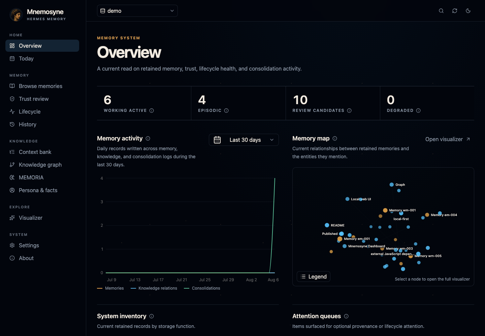

The interface above uses a synthetic mock Mnemosyne database. It does not
contain private memory data. See the [complete screenshot gallery](#screenshots)
for desktop and mobile views of the memory maps and maintenance workflows.

The source-owned React interface is the default at `/`, with Radix interaction
semantics, shadcn/ui-inspired open components, and a celestial token system.
The previous static interface remains temporarily available at `/legacy` during
the local soak period; `/candidate` is retained as a compatibility alias. The
component rules and contribution guidance are documented in
[docs/design-system.md](docs/design-system.md).

## Frontend development

The React dashboard includes the shared application shell, grouped
navigation with a collapsible desktop rail, a prominent database selector,
compact search/refresh/theme controls, a responsive mobile drawer, preset-driven
activity and inventory charts, and
fully migrated Overview, Today, Browse Memories, Trust Review, Lifecycle,
History, Context Bank, Knowledge Graph, MEMORIA, Persona & Facts, Visualizer,
Settings, and About pages. Data-heavy routes are split into lazy-loaded bundles
so the charting and exploration tools do not inflate every navigation path.
The Visualizer includes stable 2D and rotating 3D Constellation/Neural views,
label controls, fullscreen presentation, and node inspection without fetching
browser assets from a CDN. The Knowledge Graph normalizes temporal triples,
episodic graph facts, and MEMORIA relationships while retaining their
source-store provenance. Its flat 2D and volumetric 3D maps group connected data,
expose predicates, keep the selected neighborhood labeled and highlighted, and
retain the complete inspector as an overlay in fullscreen mode.

Build the checked-in React assets with Bun:

```bash
cd frontend
bun install --frozen-lockfile --ignore-scripts
bun run build
```

Then start the Python server and open `http://127.0.0.1:8765/`. Frontend
dependencies are exact-pinned, protected by a seven-day release-age gate, and
installed with lifecycle scripts disabled. See [SECURITY.md](SECURITY.md) for
the offline IOC audit workflow.

## Maintained fork

This is the `jbeno/mnemosyne-dashboard` maintained fork of the original
[`wysie/mnemosyne-dashboard`](https://github.com/wysie/mnemosyne-dashboard).
The fork exists to move outstanding fixes and current Mnemosyne/Hermes support
forward while preserving attribution and the original project’s local-first,
read-only-by-default safety model. See [MAINTENANCE.md](MAINTENANCE.md) for the
update and contribution policy.

## Installation as a Hermes plugin

Install directly from GitHub with the Hermes plugin command:

```bash
hermes plugins install jbeno/mnemosyne-dashboard --enable
```

Then restart the running Hermes process so plugin tools are discovered. For the gateway:

```bash
hermes gateway restart
```

Manual clone is also supported if you are developing the plugin locally:

```bash
git clone https://github.com/jbeno/mnemosyne-dashboard.git ~/.hermes/plugins/mnemosyne-dashboard
hermes plugins enable mnemosyne-dashboard
hermes gateway restart
```

If the directory already exists and you intentionally want to replace it, use:

```bash
hermes plugins install jbeno/mnemosyne-dashboard --enable --force
```

`--force` deletes the existing plugin directory before reinstalling, so back up any plugin-local changes first.

### Native Hermes Desktop experience

Mnemosyne Dashboard also ships an optional native Desktop plugin. It adds a
**Memory** destination directly to Hermes Desktop with a profile-aware overview,
interactive memory map, timeline, retained-memory search, and linked-node
inspection. The native view uses the active Hermes profile and does not require
the standalone web server or a browser tab.

After installing and enabling the Python plugin above, install its checked-in
Desktop bundle:

```bash
python3 ~/.hermes/plugins/mnemosyne-dashboard/scripts/install_desktop_plugin.py
```

Then restart Hermes Desktop, or run **Reload desktop plugins** from its command
palette. **Mnemosyne Memory** is enabled when first discovered because running
the separate installer is the opt-in step; it can be disabled live under
**Settings → Plugins**. You can also ask Hermes to run the
`mnemosyne_dashboard_install_desktop_plugin` tool.

The first native milestone is read-only. It opens SQLite through the same
`mode=ro` store as the web dashboard and advertises no manage/delete capability.
Memory maintenance remains in the password-gated web dashboard while the native
read path soaks. Each Desktop request is routed through the backend for the
currently active profile, so switching profiles also switches memory stores.

## Updating

If you installed with the Hermes plugin command, update with:

```bash
hermes plugins update mnemosyne-dashboard
hermes gateway restart
```

If you want to force a clean reinstall from GitHub instead of pulling into the existing directory:

```bash
hermes plugins install jbeno/mnemosyne-dashboard --enable --force
hermes gateway restart
```

If you installed or develop the plugin as a manual git clone, update with git directly:

```bash
cd ~/.hermes/plugins/mnemosyne-dashboard
git pull --ff-only
hermes gateway restart
```

Use the `git pull` path when you want to keep a normal local checkout. Use the `hermes plugins install --force` path when you want Hermes to replace the plugin directory from the remote repo.

## Screenshots

The screenshots below are generated from a synthetic mock Mnemosyne database. They do not contain private memory data.

| Desktop dark mode | Mobile dark mode |
| --- | --- |
|  | 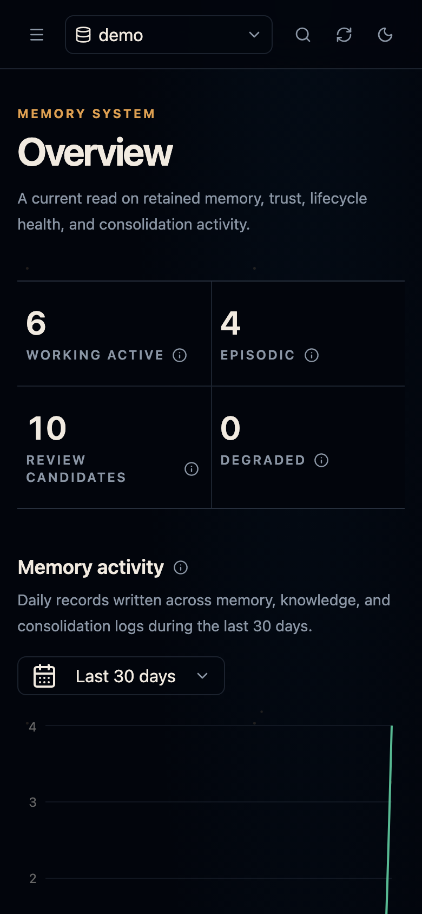 |
| 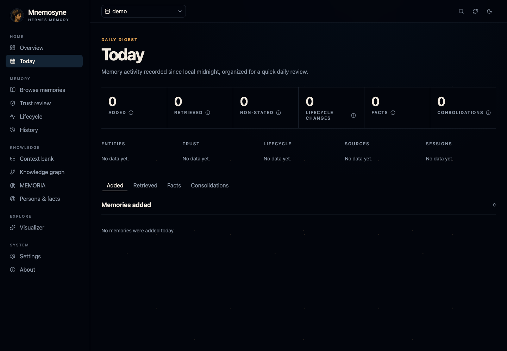 | 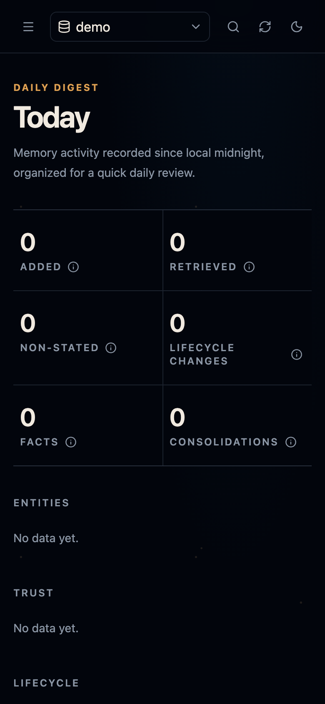 |
| 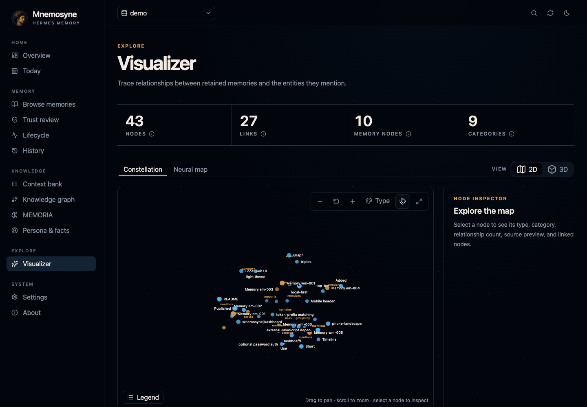 | 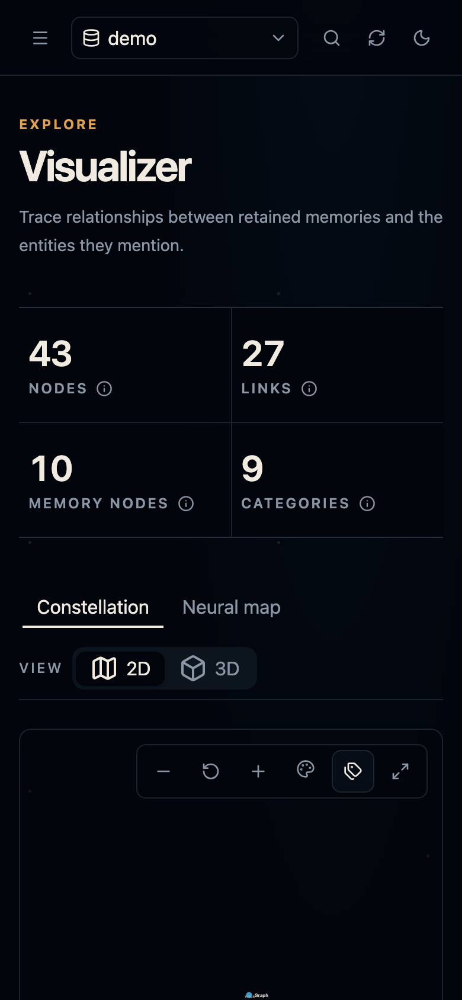 |
| 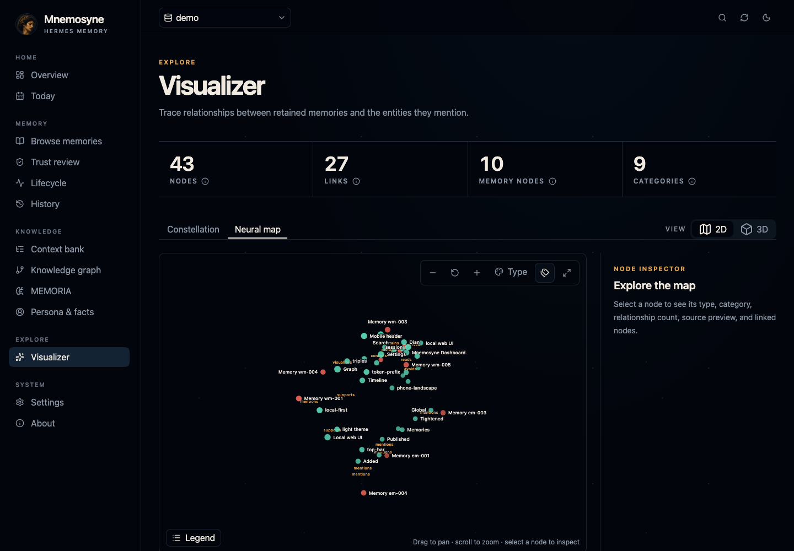 | 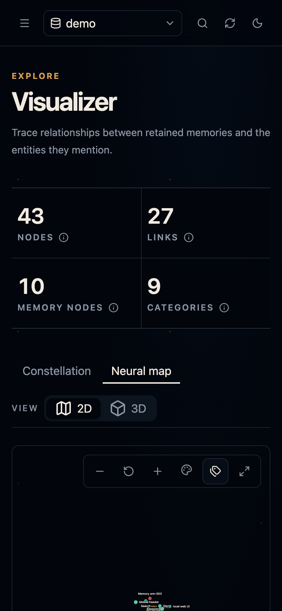 |
| 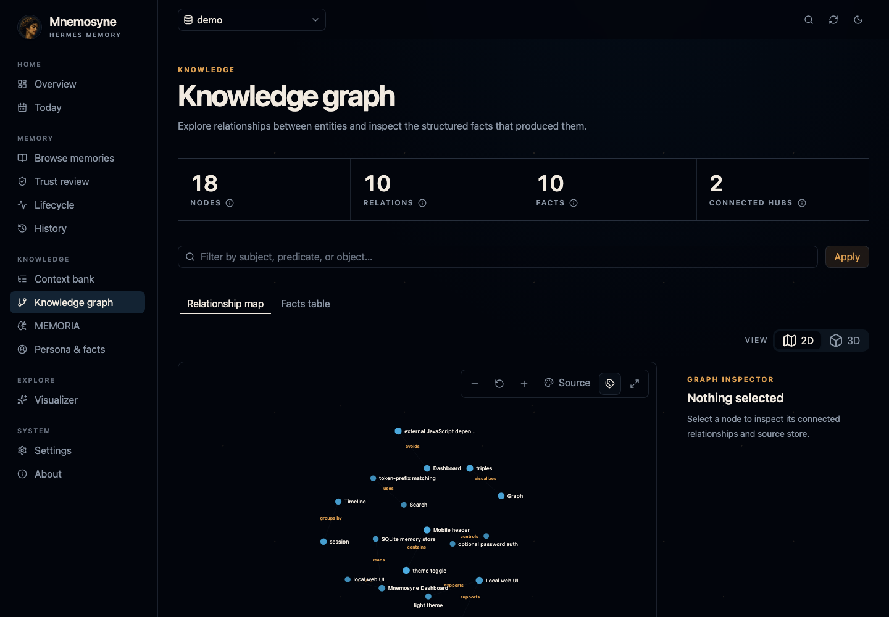 | 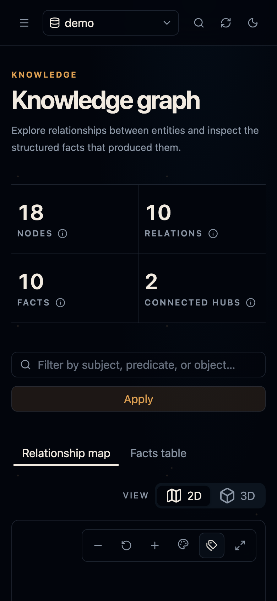 |
| 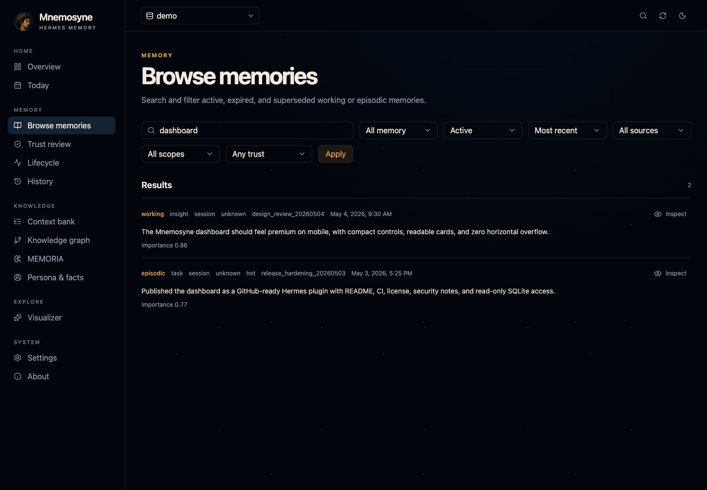 | 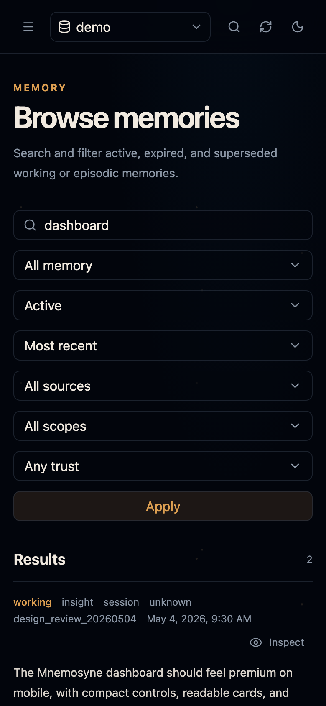 |
| 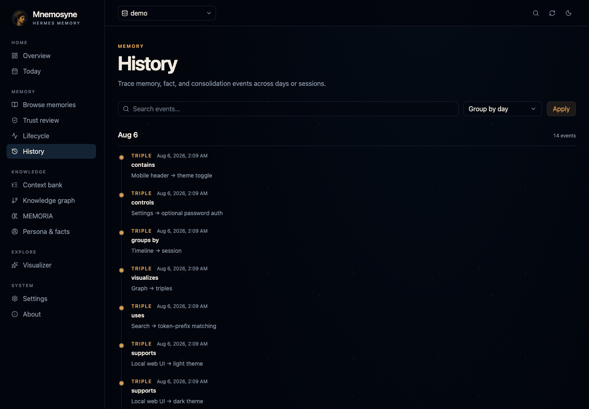 | 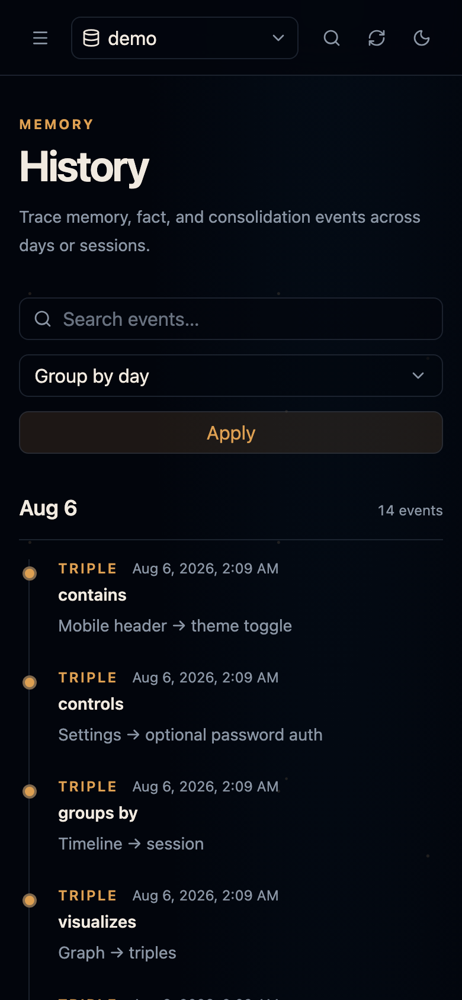 |
| 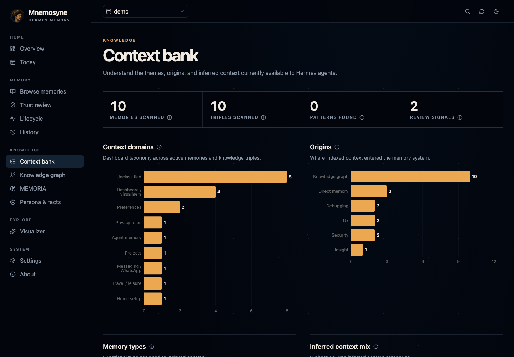 | 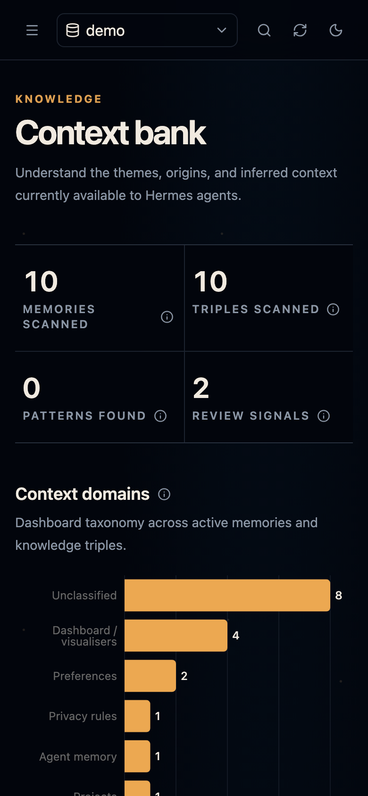 |
| 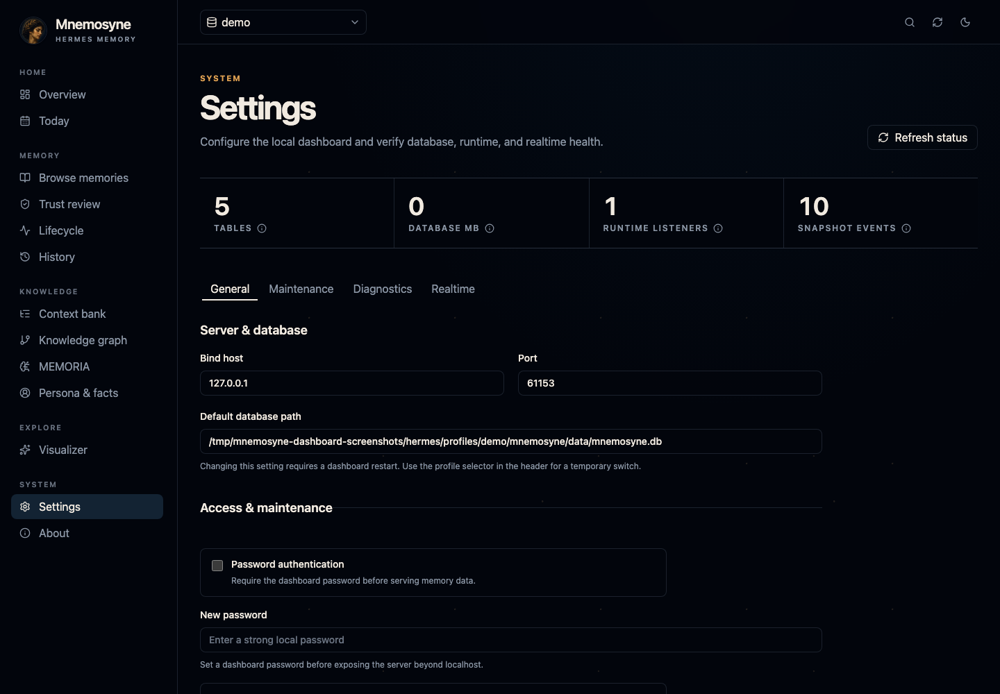 | 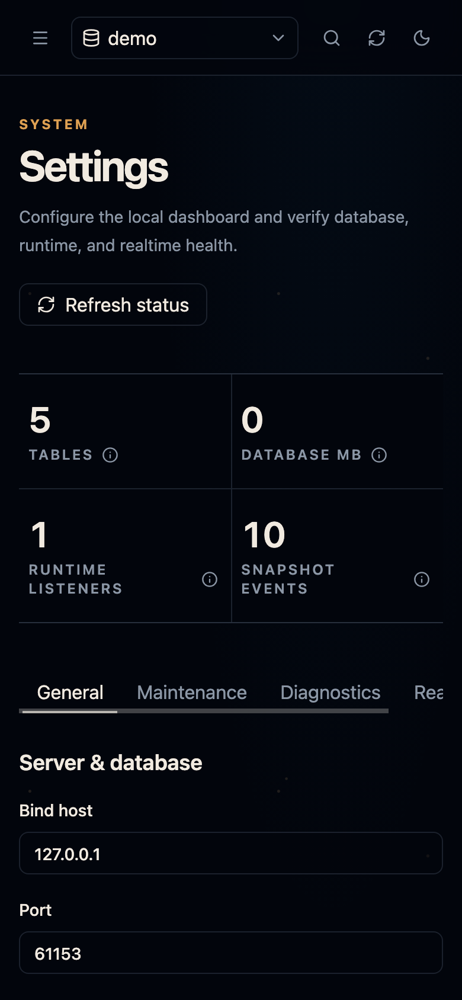 |

Regenerate the gallery locally with:

```bash
python3 scripts/generate_mock_screenshots.py
```

The generator creates a temporary synthetic SQLite database, starts the
dashboard on a random localhost port, captures desktop/mobile dark-mode views,
and writes the images to `docs/screenshots/`. It never opens the configured or
auto-discovered personal Mnemosyne database.

## Features

- Read-only Memory Intelligence views:
  - Today — daily digest of memories added/recalled, structured relations, consolidations, entities, sources, and sessions
  - Context Bank — inferred context sections derived from active memories and structured relations without writing back
  - Visualiser — selectable Constellation and Neural Map views with stable 2D and rotating 3D renderers, priority-label and legend controls, type/category coloring, category-grouped layouts, fullscreen presentation, selected-neighborhood focus, and linked-node read-only inspectors
- Nine-section product navigation instead of raw database tabs:
  - Overview — current health metrics, activity history, a compact live memory map, and operational breakdowns
  - Today — read-only daily memory digest
  - Context Bank — inferred context from active memory
  - Visualiser — Constellation and Neural Map memory visualisers
  - Explore — global search, memory browser, and recall debugger
  - Activity — timeline and consolidation history
  - Graph — relationship graph and structured-facts table
  - Settings — optional password authentication and server/database config
- Overview counts for working memory, episodic memory, structured knowledge relations, and consolidations
- Recent memory cards with raw JSON detail drawer
- Clickable overview breakdown rows and quick actions that jump into filtered workflows
- Explore section:
  - Global search across memories, structured relations, and consolidations
  - Memory browser with query, tier/source/scope/session/status filters, sorting, URL deep links, bulk selection, and safe bulk maintenance
  - Recall debugger with approximate ranking explanations
- Activity section:
  - Mini timeline grouped by day or session
  - Consolidation history with filtering, JSON inspection, and jump-to-session memories
- Graph section:
  - Interactive 2D/3D relationship graph across temporal triples, episodic facts, and MEMORIA relationships with query filtering, ambient-label and legend controls, persistent selected-neighborhood predicates, gentle unrelated-node de-emphasis, empty-canvas deselection, connection highlighting, hover summaries, orbit/pan/zoom, fullscreen inspector overlays, and reset view
  - Clickable nodes and edges
  - Inspector panel with relation-store provenance
  - Structured-facts table with temporal, episodic, and MEMORIA source badges
- Optional password authentication, configurable from the Settings tab
- Password-gated memory maintenance mode with supersede, expire/invalidate, and importance update actions
- Verified WAL-safe SQLite backups and a private JSONL audit log for configuration changes, database selection, backups, and admin memory mutations
- Switch between multiple Mnemosyne databases (for example per-profile brains) from the global desktop or mobile selector without restarting the server
- Editable Settings fields for bind address, port, and Mnemosyne database path
- Database diagnostics for install health: path, readability, file size, modified time, tables, row counts, and copyable diagnostics
- Unified session detail drawer from top sessions, consolidation entries, and timeline session chips
- Desktop and mobile responsive layouts
- Dark and light themes
- Celestial dark theme and restrained light theme with local portrait assets and no external UI runtime
- `/api/health` endpoint for smoke checks and uptime probes
- Baseline browser security headers and hardened static asset serving

## Safety model

- Binds to `0.0.0.0` by default so the dashboard is reachable on your LAN
- Reports a localhost URL for same-machine access and a LAN URL when one is detectable
- Browsing opens the Mnemosyne SQLite database with `mode=ro`
- The database selector only switches between a fixed set of databases (discovered Hermes brains, the active database, and any listed in `db_paths`); other paths are rejected, switching requires localhost or password-authenticated access, and every database is still opened read-only (`mode=ro`)
- Localhost-only memory admin can be enabled without password for developer convenience; LAN/non-local admin mode requires password auth before mutation endpoints work
- Configuration changes and manual backups require localhost or password-authenticated access even when normal read-only browsing does not require a password
- Admin actions are limited to Mnemosyne-aligned supersede, expire/invalidate, and importance updates
- Raw memory content overwrite and hard delete endpoints are intentionally not exposed
- Admin mutations create one integrity-checked SQLite online backup per operation or bulk transaction and append to `audit.jsonl`
- Config, audit, and backup storage under `~/.hermes/plugin-data/mnemosyne-dashboard/` uses owner-only permissions; backups are created with SQLite's online backup API so committed WAL data is included
- Optional password auth is disabled by default and can be enabled from Settings
- No external JavaScript or CSS dependencies
- Runtime state lives under `~/.hermes/plugin-data/mnemosyne-dashboard/`
- On macOS, run it as a separate LaunchAgent with `KeepAlive=true` if you want the dashboard to survive Hermes gateway restarts
- Static assets are resolved under `static/` before serving; path escapes are rejected
- Browser responses include CSP, no-sniff, frame-deny, and no-referrer headers

By default, the dashboard is reachable from your LAN. Treat that as exposing local memory metadata to your network. Memory admin/editing remains disabled by default; if you expose admin mode on LAN/non-local hosts, password auth is required before mutation endpoints work. Put the dashboard behind a firewall/VPN/reverse proxy auth if needed.

## Hermes tools

The plugin registers:

- `mnemosyne_dashboard_start`
- `mnemosyne_dashboard_stop`
- `mnemosyne_dashboard_status`
- `mnemosyne_dashboard_config`
- `mnemosyne_dashboard_install_desktop_plugin`

Example tool arguments:

```json
{
  "host": "0.0.0.0",
  "port": 9876,
  "db_path": "/Users/you/.hermes/mnemosyne/data/mnemosyne.db"
}
```

Changing host/port/db_path requires stopping and starting the dashboard process again.

## Configuration

Default config file:

```text
~/.hermes/plugin-data/mnemosyne-dashboard/config.json
```

Default config:

```json
{
  "host": "0.0.0.0",
  "port": 8765,
  "db_path": "~/.hermes/mnemosyne/data/mnemosyne.db",
  "auth_enabled": false,
  "memory_admin_enabled": false,
  "db_paths": []
}
```

On first config creation, the dashboard auto-detects the Mnemosyne SQLite database path by checking `MNEMOSYNE_DASHBOARD_DB`, `MNEMOSYNE_DB_PATH`, `MNEMOSYNE_DB`, then the standard Hermes path `~/.hermes/mnemosyne/data/mnemosyne.db`.

### Switching between databases

When more than one Mnemosyne database is found, the Overview "Database" card shows a selector. Choosing one switches the active database immediately, without a restart. The change is in-memory only and does not update the saved config.

The selectable databases are the currently active one, any Hermes brains found under `~/.hermes` (the root database plus `profiles/*/mnemosyne/data/mnemosyne.db`), and anything listed in the optional `db_paths` config key. Only existing files that open read-only are offered.

```json
{
  "db_paths": [
    "~/.hermes/profiles/project-manager/mnemosyne/data/mnemosyne.db"
  ]
}
```

`db_paths` is optional; when it is empty, only the active database and auto-discovery are used.

You can update it through the Hermes tool:

```json
{
  "host": "0.0.0.0",
  "port": 9876
}
```

Or edit JSON directly, then restart the dashboard.

Environment overrides are also supported:

- `MNEMOSYNE_DASHBOARD_CONFIG` — alternate config file path
- `MNEMOSYNE_DASHBOARD_HOST` — bind address
- `MNEMOSYNE_DASHBOARD_PORT` — bind port
- `MNEMOSYNE_DASHBOARD_DB` — SQLite DB path
- `MNEMOSYNE_DB_PATH` / `MNEMOSYNE_DB` — also considered during first-run DB auto-detection

## Manual run

Hermes is not a runtime dependency. To use the dashboard with any compatible
Mnemosyne SQLite database, pass its path explicitly:

```bash
python server.py --host 127.0.0.1 --port 8765 --db /absolute/path/to/mnemosyne.db
```

The dashboard remains read-only unless memory admin is explicitly enabled. Its
configuration and audit state default to `~/.hermes/plugin-data/mnemosyne-dashboard`;
set `MNEMOSYNE_DASHBOARD_CONFIG` if you want a completely separate location.

```bash
python server.py --host 0.0.0.0 --port 8765
```

Bind to localhost only:

```bash
python server.py --host 127.0.0.1 --port 8765
```

Open locally:

```text
http://127.0.0.1:8765/
```

If bound to `0.0.0.0`, use your machine’s LAN IP from another device, e.g.:

```text
http://192.168.1.10:8765/
```

## Optional macOS launchd auto-restart

If you want the dashboard to survive Hermes gateway restarts or plugin-owned process shutdowns, run it as a separate macOS LaunchAgent instead of starting it from inside the Hermes gateway process.

The helper below writes `~/Library/LaunchAgents/<label>.plist` with `RunAtLoad=true` and `KeepAlive=true`, then bootstraps it into the current GUI session:

```bash
cd ~/.hermes/plugins/mnemosyne-dashboard
MNEMOSYNE_DASHBOARD_LAUNCHD_LABEL=io.example.mnemosyne-dashboard \
MNEMOSYNE_DASHBOARD_HOST=127.0.0.1 \
MNEMOSYNE_DASHBOARD_PORT=8765 \
bash scripts/install_launchd_macos.sh
```

Useful service commands:

```bash
LABEL=io.example.mnemosyne-dashboard
PLIST=~/Library/LaunchAgents/$LABEL.plist

# Restart without unloading the service
launchctl kickstart -k gui/$(id -u)/$LABEL

# Full reload after changing the plist
launchctl bootout gui/$(id -u) "$PLIST" 2>/dev/null || true
launchctl bootstrap gui/$(id -u) "$PLIST"
launchctl kickstart -k gui/$(id -u)/$LABEL

# Status, listener, and smoke check
launchctl print gui/$(id -u)/$LABEL | head -80
lsof -nP -iTCP:8765 -sTCP:LISTEN
curl -fsSI http://127.0.0.1:8765/ | head
```

Keep the bind host as `127.0.0.1` unless you explicitly want LAN access to memory metadata.

## Development

```bash
cd ~/.hermes/plugins/mnemosyne-dashboard
~/.hermes/hermes-agent/venv/bin/python -m ruff check .
~/.hermes/hermes-agent/venv/bin/python -m pytest -q
~/.hermes/hermes-agent/venv/bin/python -m compileall -q .
node --check static/app.js
scripts/build_desktop_plugin.sh
git diff --exit-code -- desktop/plugin.js
```

Restart the dashboard after backend/server changes:

```bash
~/.hermes/hermes-agent/venv/bin/python - <<'PY'
import importlib.util, pathlib
p=pathlib.Path.home()/'.hermes/plugins/mnemosyne-dashboard/__init__.py'
spec=importlib.util.spec_from_file_location('mnemo_dash', p)
mod=importlib.util.module_from_spec(spec); spec.loader.exec_module(mod)
print(mod._stop({}))
print(mod._start({}))
PY
```

## Repository layout

```text
plugin.yaml
__init__.py              # Hermes tool registration + process lifecycle
config.py                # Config file/env/default resolution
server.py                # ThreadingHTTPServer + API/static routes
dashboard_core.py        # Read-only SQLite access
desktop_api.py           # Profile-aware native Desktop read model
dashboard/               # Hermes namespaced FastAPI routes
desktop/src/             # Source for the native Hermes Desktop plugin
desktop/plugin.js        # Checked-in single-file runtime bundle
tests/                   # pytest coverage for core/config behavior
static/                  # HTML/CSS/JS/fonts
.github/workflows/ci.yml # GitHub Actions smoke tests
```

## Font/assets note

The light theme uses locally hosted Playfair Display, Great Vibes, and Cormorant Garamond font assets. These font families are available under the SIL Open Font License from Google Fonts. Keep font licensing notices intact if replacing or redistributing assets.
